# NyaruDB2 — Architecture

This document describes how NyaruDB2 works internally: the storage format, the
concurrency model, the indexing and query engine, and the durability
guarantees. It is aimed at contributors and at users who want to understand the
performance and safety characteristics of the engine.

For installation and usage, see the [README](./README.md).

---

## Table of contents

- [NyaruDB2 — Architecture](#nyarudb2--architecture)
  - [Table of contents](#table-of-contents)
  - [1. Design goals](#1-design-goals)
  - [2. Layered overview](#2-layered-overview)
  - [3. On-disk layout](#3-on-disk-layout)
  - [4. The shard file: `SlottedFile`](#4-the-shard-file-slottedfile)
    - [Why capacity is padded to 32 bytes](#why-capacity-is-padded-to-32-bytes)
    - [Slot lifecycle](#slot-lifecycle)
    - [Read paths](#read-paths)
  - [5. Partitioning and shard routing](#5-partitioning-and-shard-routing)
  - [6. Indexing: `OrderedIndex`](#6-indexing-orderedindex)
    - [Dead slots — why removal is amortised O(1)](#dead-slots--why-removal-is-amortised-o1)
    - [Bulk merge](#bulk-merge)
  - [7. Write paths](#7-write-paths)
    - [7.1 Single insert](#71-single-insert)
    - [7.2 Batch insert — the fast path](#72-batch-insert--the-fast-path)
    - [7.3 Update](#73-update)
    - [7.4 `writeBatch` — atomic multi-operation writes](#74-writebatch--atomic-multi-operation-writes)
  - [8. Read and query paths](#8-read-and-query-paths)
    - [8.1 Point get](#81-point-get)
    - [8.2 Query planning](#82-query-planning)
    - [8.3 Query execution](#83-query-execution)
  - [9. Concurrency model](#9-concurrency-model)
    - [The compaction gate](#the-compaction-gate)
  - [10. Compaction](#10-compaction)
  - [11. Durability, crash recovery, and integrity](#11-durability-crash-recovery-and-integrity)
    - [The dirty flag](#the-dirty-flag)
    - [The state sidecar (`.nyaru.state`)](#the-state-sidecar-nyarustate)
    - [Crash recovery](#crash-recovery)
    - [Durability policy](#durability-policy)
    - [Integrity summary](#integrity-summary)
  - [12. Serialization, compression, and encryption](#12-serialization-compression-and-encryption)
    - [Formats](#formats)
    - [Field extraction without full decode](#field-extraction-without-full-decode)
    - [The payload pipeline](#the-payload-pipeline)
    - [Encryption at rest](#encryption-at-rest)
  - [13. Design trade-offs and non-goals](#13-design-trade-offs-and-non-goals)
    - [Complexity summary](#complexity-summary)

---

## 1. Design goals

NyaruDB2 is an embedded document database for iOS and macOS. The design is
driven by four goals, in priority order:

| Goal | What it means in practice |
|------|---------------------------|
| **Idiomatic Swift API** | Documents are plain `Codable` structs. No base class, no schema definition, no code generation, no `NSManagedObject`, no migration ceremony. |
| **Correctness over speed** | Every record is CRC-checked. Ambiguous states fail closed, never open. A read that cannot prove its result is valid returns nothing rather than something wrong. |
| **Mobile-appropriate cost** | Bounded memory on scans, no background write amplification, no daemon threads. Work happens when the caller asks for it. |
| **Structural concurrency safety** | Swift actors, not locks. The type system enforces the isolation instead of convention. |

The API surface is the constraint everything else is designed around. Several
otherwise attractive optimizations (notably CoreData-style *faulting*, which
requires intercepting property access at runtime) are not implementable on top
of plain `Codable` value types, and are deliberately not pursued.

---

## 2. Layered overview

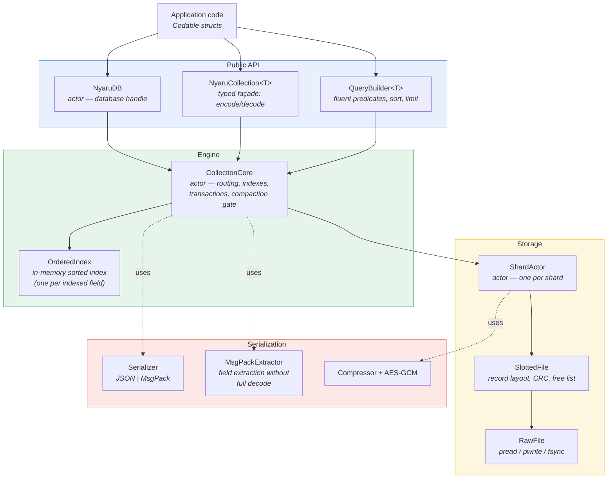

**Responsibilities:**

| Component | Role |
|-----------|------|
| `NyaruDB` | Database handle. Owns collections, opens/creates them from a manifest, drives `sync()` and `close()`. |
| `NyaruCollection<T>` | Typed façade. The **only** layer that knows about `T`: it encodes documents to bytes and decodes bytes back to `T`. Everything below it works on `Data`. |
| `QueryBuilder<T>` | Fluent query construction, planning, and execution. |
| `CollectionCore` | The engine. Actor owning the indexes, the shard map, transactional batch semantics, and the compaction gate. |
| `OrderedIndex` | One fully in-memory sorted index per indexed field. |
| `ShardActor` | Serializes all I/O to one shard file. Handles compression and encryption. |
| `SlottedFile` | The record layout: slots, headers, CRC, tombstones, free list. |
| `RawFile` | Thin `pread`/`pwrite`/`fsync` wrapper — positional I/O, no shared file cursor. |

A useful invariant: **type erasure happens at the collection boundary.** The
engine never decodes a document into `T`. It reads bytes, and extracts
individual field values from those bytes when it needs index keys.

---

## 3. On-disk layout

```
database/
├── users/                         ← one directory per collection
│   ├── manifest.json              ← collection config (encrypted if a key is set)
│   ├── shards/
│   │   ├── SaoPaulo.nyaru         ← shard file (one per partition value)
│   │   ├── SaoPaulo.nyaru.state   ← clean-state sidecar (free list + live count)
│   │   ├── RioDeJaneiro.nyaru
│   │   └── RioDeJaneiro.nyaru.state
│   └── indexes/
│       ├── id.idx                 ← index snapshot
│       ├── city.idx
│       └── age.idx
└── orders/
    └── ...
```

The **manifest** is the source of truth for a collection's configuration: id
field, partition key, indexed fields, serialization format, compression,
encryption flag, file protection, fragmentation threshold. Reopening a
collection with an incompatible configuration is rejected
(`NyaruError.collectionTypeMismatch`) rather than silently reinterpreting data.

---

## 4. The shard file: `SlottedFile`

A shard is a flat sequence of **slots**. Each slot holds one record and never
moves for the lifetime of the file (only compaction rewrites the file).

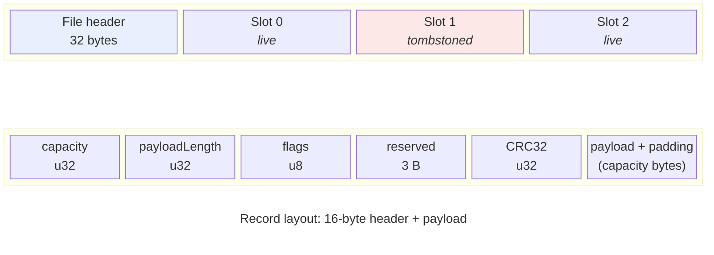

**File header (32 bytes):** magic `NYU2`, format version, flags (bit 0 = dirty),
live record count, reserved bytes.

**Record header (16 bytes):**

| Field | Size | Purpose |
|-------|------|---------|
| `capacity` | `u32` | Bytes reserved for the payload, rounded up to a multiple of **32**. |
| `payloadLength` | `u32` | Actual payload bytes used (`≤ capacity`). |
| `flags` | `u8` | Bit 0 = tombstone; bits 1–3 = compression method (gzip / lzfse / lz4). |
| reserved | 3 B | Padding to keep the header 16-byte aligned. |
| `crc` | `u32` | CRC32 of the payload as stored (i.e. after compression/encryption). |

### Why capacity is padded to 32 bytes

The gap between `payloadLength` and `capacity` is slack. It is what makes
**in-place updates** possible: if a document grows slightly, the new payload
still fits the existing slot, and the update is a single `pwrite` at the same
offset. No new slot, no index pointer change. Only when the new payload exceeds
`capacity` does the update fall back to tombstone + append.

### Slot lifecycle

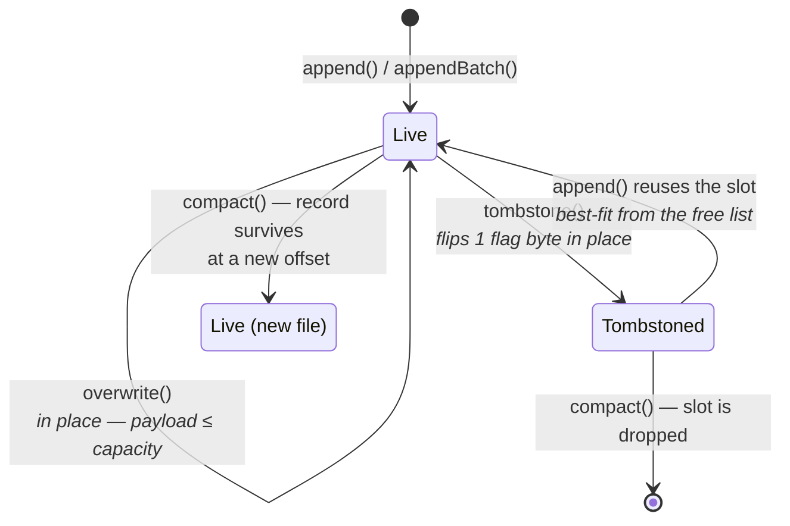

**A delete is one byte.** `tombstone(at:)` reads the record header, sets bit 0
of the flags, and writes that single byte back. The slot's `(offset, capacity)`
then joins an in-memory **free list**, kept sorted by capacity so that `append`
can find a **best-fit** slot with a binary search.

Before reusing a free slot, `append` re-reads the on-disk header and verifies
that the capacity matches and the tombstone bit is actually set
(`isReusableSlot`). If the disk disagrees with the free list, the slot is
**forgotten rather than overwritten** — a stale free-list entry can never
clobber a live record. This is a concrete instance of the fail-closed rule.

### Read paths

| Path | Behaviour |
|------|-----------|
| **Point read** (`read(at:)`) | One *speculative* `pread` of up to 4 KiB from the record offset — header and, for typical documents, the entire payload arrive in a **single syscall**. Oversized payloads trigger one extra read for the remainder. CRC is verified before the payload is returned; a mismatch throws `corruptedRecord`. |
| **Full scan** (`forEachLive`) | Streams the file through a **4 MiB sliding window**, decoding headers in place. Payloads that straddle the window boundary are read directly. Memory is bounded by the window, not by the file size. |
| **Cursor batch** (`readLiveBatch`) | Pull-driven streaming: reads a chunk sized for the requested record count, returns the records plus a cursor for the next call. This backs `NyaruDocumentStream`. |

---

## 5. Partitioning and shard routing

A collection may declare a `partitionKey`. Documents are routed to a shard file
by the value of that field.

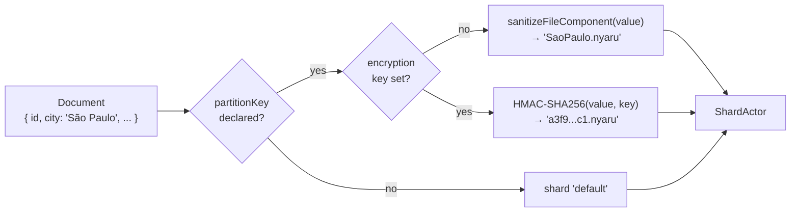

Two consequences worth knowing:

- **Partitioning is physical, not logical.** A query filtered on the partition
  key can read exactly one file (`partitionScan`) and ignore the rest.
- **With encryption enabled, shard filenames are HMACs.** Otherwise the
  partition values (e.g. customer names) would leak through the filesystem even
  though the record contents are sealed.

Shard count is therefore driven by the cardinality of the partition key. A
high-cardinality partition key (e.g. user id) produces one file per document
and is a misuse; partition on something with tens or hundreds of distinct
values.

---

## 6. Indexing: `OrderedIndex`

Every indexed field gets one `OrderedIndex`, held **entirely in memory** and
persisted as a snapshot. The id field is always indexed, whether or not it is
listed.

The structure is two parallel sorted arrays:

```
keys:     [ "Belo Horizonte", "Curitiba",  "Rio",      "São Paulo" ]
postings: [ [p1, p7],         [],          [p3],       [p2, p4, p9] ]
                              ↑ dead slot (key semantically absent)
```

Lookups binary-search `keys`; the matching `postings` entry is the list of
`RecordPointer` (shard id + offset) for that key.

### Dead slots — why removal is amortised O(1)

Removing a key from a sorted array shifts every element behind it: O(n) per
removal. Worse, one-by-one deletes tend to empty their id-index key every time,
and a FIFO deletion pattern empties position 0 — the worst case, repeatedly.

Instead, when a posting list becomes empty the key stays in the array as a
**dead slot**, and the arrays are rebuilt in a single O(n) sweep once dead slots
exceed a quarter of the keys.

The invariant every reader must honour: **`postings[i].isEmpty` means the key is
absent.** `search`, `range`, and `replace` are naturally correct (an empty list
contributes nothing). `contains`, `allKeys`, `uniqueKeyCount`, and `keysInRange`
check explicitly. Bulk operations (`bulkLoad`, `bulkRemove`, `compactRemap`) and
snapshots drop dead slots for free, since they rebuild the arrays anyway.

### Bulk merge

`bulkLoad` sorts the incoming entries once and merges them into the existing
arrays in a **single linear pass**, rather than doing N binary-search inserts.
This is what makes batch insert cheap: one merge per index, and the indexes are
independent objects, so the merges run in parallel across fields.

---

## 7. Write paths

### 7.1 Single insert

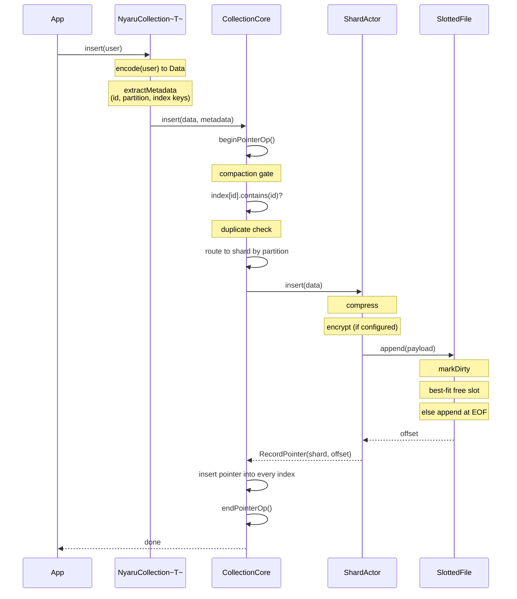

Metadata extraction happens in the **collection layer**, before the engine is
touched: the document's id, partition value, and index keys are pulled from the
encoded bytes in one pass.

### 7.2 Batch insert — the fast path

`insert(contentsOf:)` and pure-insert `writeBatch`es take a distinct path:

1. Encode + extract metadata for all documents **in parallel** (CPU-bound, no
   I/O).
2. Group by target shard.
3. Per shard: compress/encrypt all payloads in parallel, then build **one
   contiguous buffer** and issue **one `pwrite`** (`appendBatch`).
4. One `bulkLoad` merge per index, indexes merged in parallel.

Note that `appendBatch` **never reuses free slots** — it always appends at EOF.
This is deliberate: it keeps the write a single sequential syscall, and it is
what makes the rollback in `writeBatch` tractable (see below).

### 7.3 Update

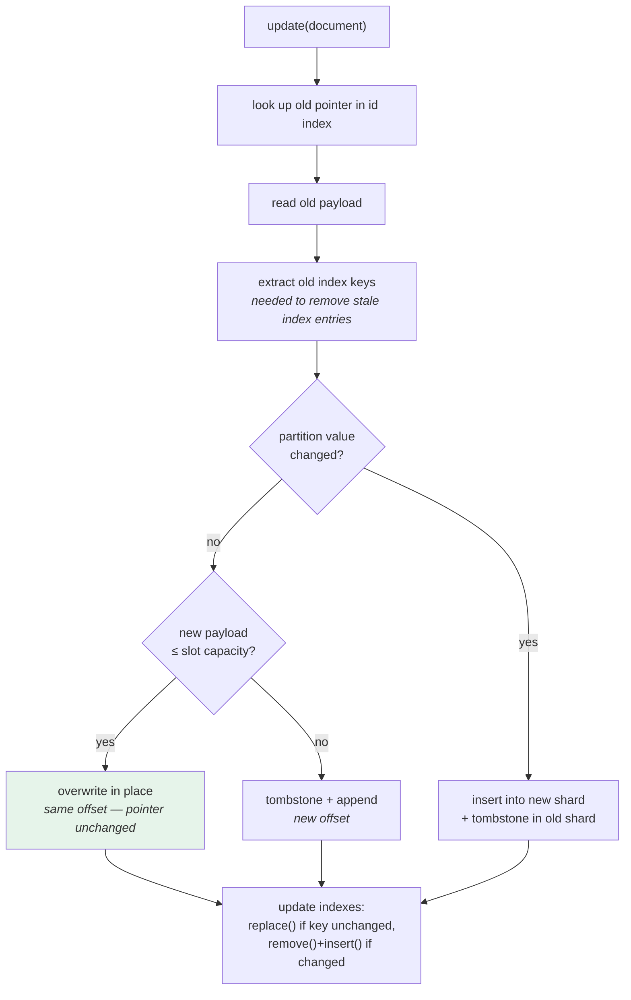

The old payload must be read even for an in-place update, because the old index
keys live in it and stale index entries would otherwise survive. `patch(id:changes:)`
avoids re-encoding the whole document, but still reads the old version.

### 7.4 `writeBatch` — atomic multi-operation writes

`writeBatch` executes mixed inserts/updates/upserts/deletes with all-or-nothing
semantics, in four phases:

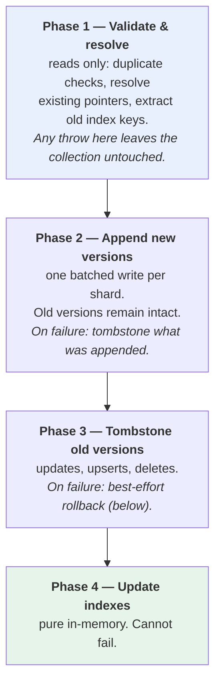

The interesting case is a **failure in phase 3**, where some old versions were
tombstoned and others were not. Rolling everything back is not possible — the
tombstone already landed. The rule, applied per operation:

- **Old version already tombstoned** → the newly appended version is now the
  *only* copy of that document. Rolling it back would **lose data**. It is kept
  and made visible in the indexes (a partial commit of that one operation).
- **Old version still live, or a plain insert** → tombstone the append; the
  pre-batch state remains authoritative.

If probing the old record fails, it is *assumed tombstoned* — preferring the new
version risks a duplicate after an index rebuild, whereas assuming "live" would
tombstone the only surviving copy. **Duplicates are recoverable; data loss is
not.** That asymmetry is the whole reason the phases are ordered this way.

---

## 8. Read and query paths

### 8.1 Point get

`get(id:)` is: binary search the id index → one `pread` → CRC → decrypt →
decompress → `Codable` decode. No scan, no predicate evaluation.

### 8.2 Query planning

`plan()` runs **once** per query execution. It flattens the top-level `AND`
conjuncts, asks the core (in a **single actor hop**) which of the referenced
fields are indexed, and picks a strategy:

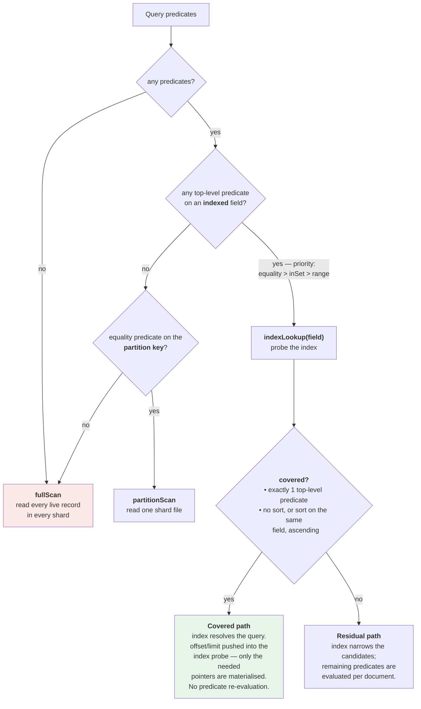

**Covered queries** are the fast lane. Because the index probe alone answers the
predicate, `limit`/`offset` are pushed *into* the index range scan — a
`limit(10)` over a range of 100,000 matches stops collecting pointers after 10.
Two further index-only paths exist:

- `count()` on a covered query never touches disk — it counts pointers
  (`coveredCount`).
- `distinctValues(on:)` on an indexed field enumerates the index keys directly
  (`distinctKeys`), also with zero I/O.

### 8.3 Query execution

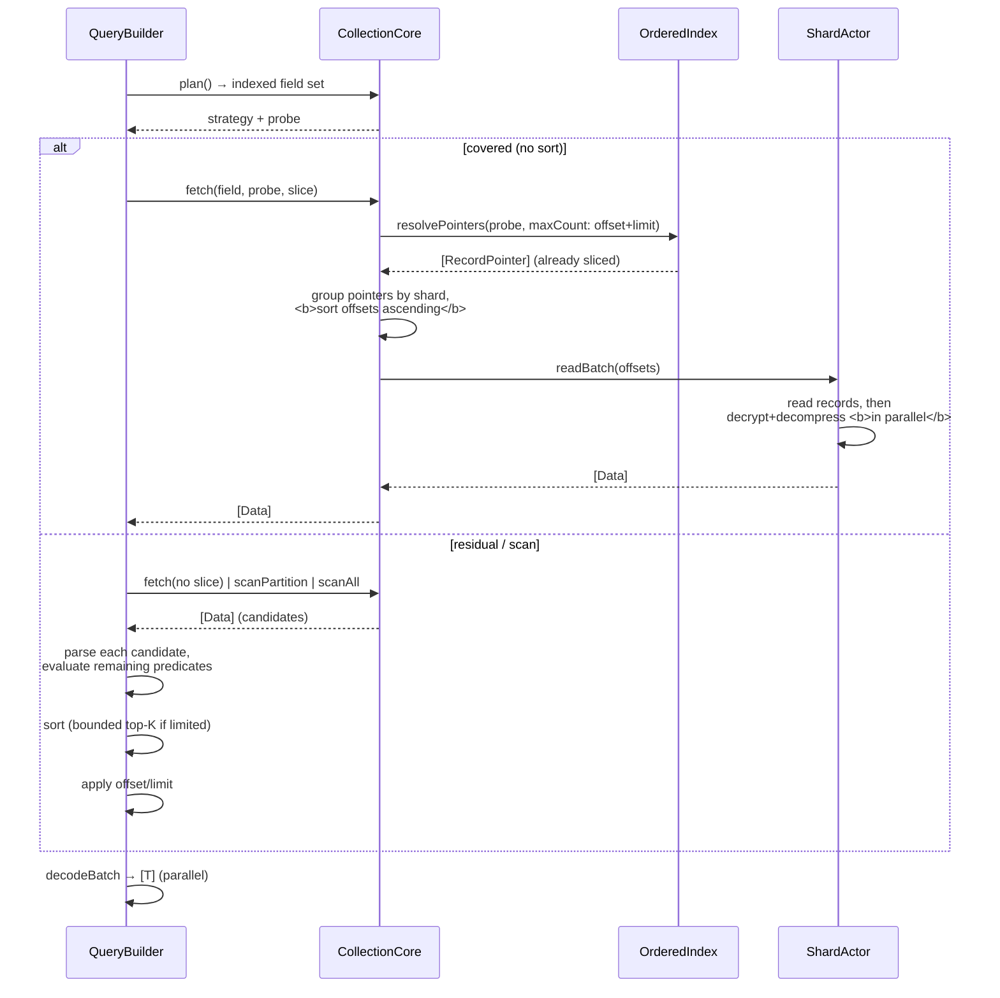

Two details worth calling out:

- **Offsets are sorted before reading.** Pointers from an index arrive in key
  order, which is random file order. Sorting them turns random seeks into a
  forward walk of the file.
- **Sorted + limited queries use a bounded top-K heap** (`BoundedTopK`), so a
  `sort(...).limit(10)` over a large candidate set keeps only 10 items in memory
  instead of sorting everything.

---

## 9. Concurrency model

NyaruDB2 uses **actors**, not locks. The isolation is enforced by the compiler.

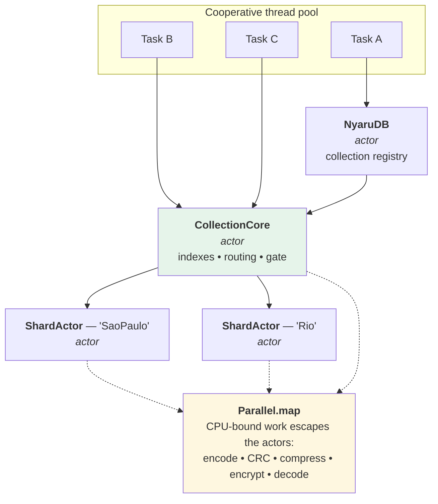

The shape of it:

- **One `ShardActor` per shard file.** Different shards proceed genuinely in
  parallel; two writes to different partitions never contend.
- **`CollectionCore` is a single actor** because the indexes are shared mutable
  state. It is the serialization point for index maintenance.
- **CPU-bound work is deliberately pushed outside the actors.** Encoding, CRC,
  compression, encryption, and decoding are pure functions over `Data` — they
  run through `Parallel.map` across all cores while the actor is not held.

### The compaction gate

Compaction rewrites a shard file, invalidating every offset in it, and *then*
remaps the index pointers. The actor suspends at each `await` inside `compact()`,
which opens a window for a concurrent pointer-based operation to interleave — a
`get` would read a stale offset against the rewritten file, and an `insert`
would register pointers into the new file that the subsequent remap would then
drop as "stale".

The gate closes that window:

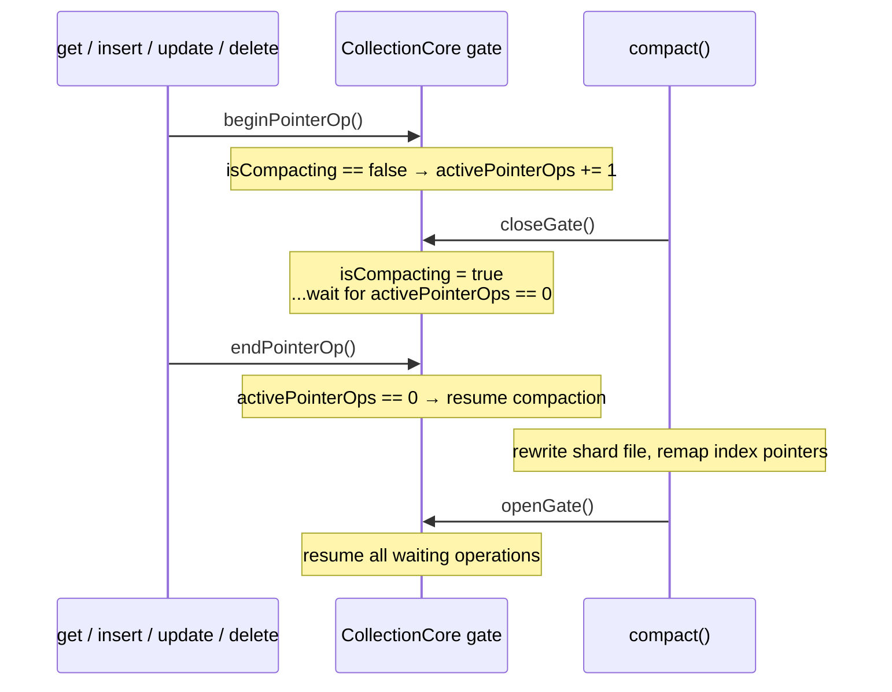

Every pointer-based operation — `get`, `insert`, `update`, `patch`, `delete`,
`deleteMany`, `fetch`, `applyBatch`, index rebuilds — brackets itself with
`beginPointerOp()` / `endPointerOp()`. Compaction drains them all before
touching a file. Scans (`scanAll`, `scanPartition`) do not take the gate: they
read live records by walking the file, not by following stored pointers.

---

## 10. Compaction

Tombstoned slots are reused by `append` when a new record fits, but a file with
many small dead slots and no matching inserts stays fragmented. Compaction
rewrites the shard, dropping the dead slots.

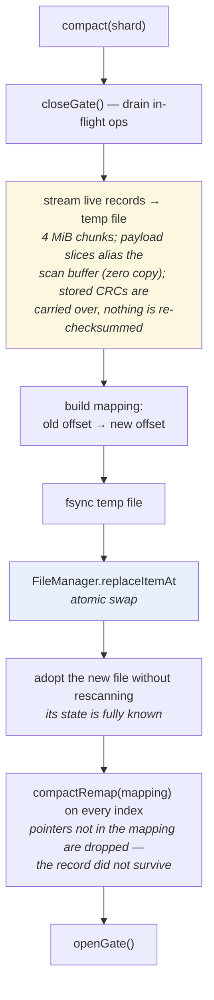

Properties:

- **Per shard, not global.** One shard is compacted at a time, and the gate is
  released between shards. A large collection does not freeze wholesale.
- **Bounded memory.** Live records are streamed in 4 MiB chunks. Peak memory is
  roughly one chunk, not one copy of the file.
- **Atomic.** The swap is `replaceItemAt`. A crash mid-compaction leaves the
  original file intact; the temp file is orphaned and discarded.
- **Triggered, not automatic.** `needsCompaction()` reports when a shard's
  tombstone ratio exceeds `maxFragmentation` (default 0.2, requires >100
  records). Calling `compact()` is the application's decision — there is no
  background thread doing it behind your back, by design.

---

## 11. Durability, crash recovery, and integrity

### The dirty flag

A shard file carries a dirty bit in its header.

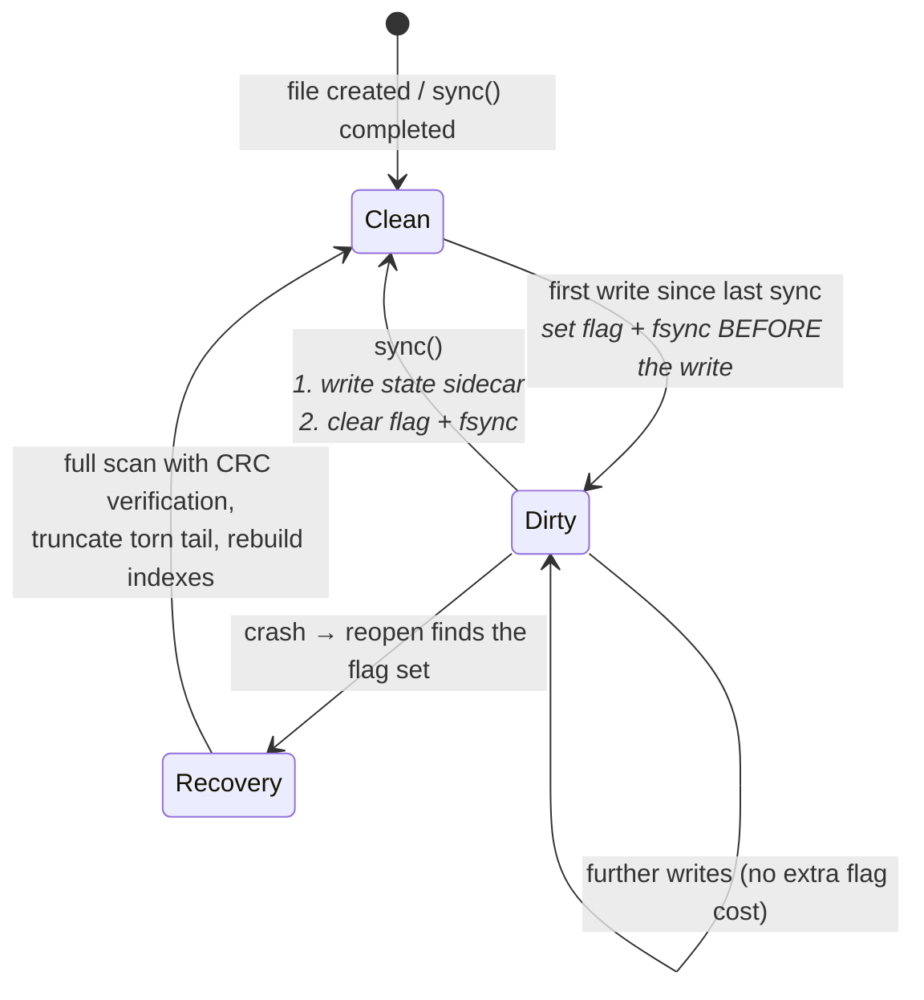

The ordering matters in both directions:

- **Setting** the flag is fsynced *before* the first write lands. A crash can
  therefore never produce modified data with a clean flag.
- **Clearing** it writes the state sidecar *first*, then clears the flag. A
  crash in between leaves the flag set, which forces a full recovery scan —
  costly, but never wrong.

### The state sidecar (`.nyaru.state`)

A clean shutdown persists the free list and live count next to the shard, so the
next open skips a full file scan. The sidecar is **only trusted on a clean
open**, and even then it is validated: magic, version, a stored file size that
must match the actual file size, and a CRC32 over its own contents. Any mismatch
falls back to a scan. It is a cache, never an authority.

### Crash recovery

On opening a shard whose dirty flag is set, the engine **verifies everything**:

1. Walk every slot, recomputing the **CRC of each live record**. A record whose
   CRC does not match is tombstoned — it is corrupt, and a corrupt record that
   is *readable* is more dangerous than one that is gone.
2. An invalid header mid-file means a **torn append** (or trailing garbage,
   which would otherwise hide every future append behind it). The file is
   **truncated** at that point.
3. The collection rebuilds all indexes from the surviving records — offsets in
   the index snapshots cannot be trusted after a crash.

### Durability policy

Writes go to the OS page cache; `fsync` happens on `sync()`, `close()`, and per
the `autoSync` policy:

| `AutoSyncPolicy` | Behaviour |
|------------------|-----------|
| `.off` (default) | fsync only on explicit `sync()` / `close()`. Fastest; a crash can lose writes since the last sync (but never corrupt the file — see the dirty flag). |
| `.afterWrites(n)` | fsync after every *n* writes. |
| `.interval(seconds)` | fsync when writes are pending and the interval has elapsed. |

`sync()` also persists the index snapshots. Because snapshot serialization
happens **off the actor** (writes must not be blocked by disk I/O for the
indexes), it re-checks a monotonic write generation afterwards: if writes raced
the persist, it retries, up to three attempts, before taking the gate and
finishing.

### Integrity summary

| Layer | Protection |
|-------|-----------|
| Record | CRC32 of the stored payload, verified on **every** read |
| Free slot reuse | On-disk header re-verified before overwrite — stale free-list entries are forgotten, never trusted |
| Shard file | Magic + version + dirty flag; torn tail truncated on recovery |
| State sidecar | Magic + version + file-size match + CRC32; treated as a cache |
| Index snapshot | Discarded entirely if any shard was dirty — rebuilt from data |
| Batch writes | Four-phase commit with a data-loss-averse rollback |
| Encrypted payloads | AES-GCM — authentication tag detects tampering, not just corruption |

---

## 12. Serialization, compression, and encryption

### Formats

Two wire formats: **JSON** (default) and **MsgPack**. Both go through `Codable`,
so the choice is transparent to the document type. MsgPack is more compact and
faster to parse; it is also the format that unlocks the extractor path below.

### Field extraction without full decode

The engine constantly needs *a few fields* out of a document (the id, the
partition value, the indexed keys) and never needs the whole struct.
`MsgPackExtractor.extractTopLevelFields` scans raw MsgPack bytes for a set of
top-level keys and returns just those values — no dictionary materialisation, no
`Codable` round trip.

This is used on the delete path (to learn which index keys to remove), on the
update path, in `deleteMany`, and during index rebuilds. Dot-paths (nested
fields) fall back to a full parse.

### The payload pipeline

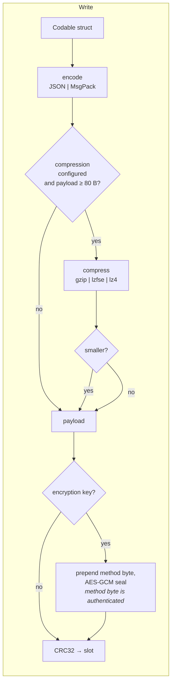

Reads run the pipeline in reverse. Three details:

- Compression is **only kept if it actually shrinks the payload**, and is skipped
  entirely below 80 bytes.
- When encryption is on, the compression method byte is stored *inside* the
  sealed box and passed as **authenticated data** — an attacker cannot flip the
  compression method to steer the decompressor.
- CRC is computed over the payload **as stored**. It detects storage corruption;
  the GCM tag detects tampering. Different jobs.

### Encryption at rest

AES-GCM per record, plus:

- The **manifest** is sealed with the same key (the schema is metadata worth
  protecting).
- **Index snapshots** are sealed — they contain every indexed key value.
- **Shard filenames** are HMAC-SHA256 of the partition value (§5).

Keys are supplied by the caller as a `SymmetricKey`. `KeyDerivation` provides
PBKDF2-HMAC-SHA256 at OWASP-recommended iteration counts for deriving one from a
password. NyaruDB2 does not manage key storage — that is the Keychain's job.

---

## 13. Design trade-offs and non-goals

Being explicit about what this engine is *not*, and why:

| Not doing | Why |
|-----------|-----|
| **Leveled LSM tree** (SSTables, multi-level compaction, bloom filters) | The engine already has the useful subset: batched sequential appends, an in-memory sorted index (the memtable role), tombstones, and streaming compaction (the merge role). Full LSM machinery buys sustained-write throughput at the cost of background write amplification — battery and flash wear on a phone. |
| **Faulting / lazy proxy objects** (the CoreData trick) | Requires intercepting property access, which the Objective-C runtime provides for `NSManagedObject` and Swift does not provide for `Codable` structs. Implementing it means giving up the plain-struct API — the one thing this project refuses to trade. A projection API (`select`) achieves most of the benefit without it. |
| **`mmap` for the read path** | Point reads are already a single `pread`; scans are windowed. `mmap` interacts badly with iOS file protection (page faults after device lock), needs remapping on file growth, and needs a fence around compaction's file swap — a live pointer into a replaced mapping is a use-after-unmap crash. It also cannot help at all when payloads are compressed or encrypted, since the bytes on disk are not the bytes you want. |
| **MVCC / snapshot isolation** | Actors currently serialize reads behind writes on a collection. Snapshot reads (a copy-on-write view of the index arrays) are a plausible future addition, but the cost is real complexity in the compaction gate, and the benefit only shows up under genuinely concurrent read/write load. |
| **A background compaction thread** | Predictability. On mobile, the app decides when to spend I/O and battery. `needsCompaction()` tells you when it is worth doing; `compact()` does it when you say so. |
| **SQL** | This is a document store. The query builder is typed, composable, and refactor-safe; a SQL string is none of those things. |

### Complexity summary

| Operation | Cost |
|-----------|------|
| `get(id:)` | O(log k) index search + 1 pread |
| `insert` | O(log k) per index + 1 pwrite (or 0 syscalls amortised in a batch) |
| `insert(contentsOf:)` | 1 pwrite per shard + one O(n + m) merge per index |
| `update` | 1 pread + 1 pwrite in place (payload fits), else tombstone + append |
| `delete` | 1 pread (index keys) + 1-byte pwrite + O(1) amortised per index |
| Covered query | O(log k) + limit-bounded pointer collection + 1 read per record |
| Residual query | candidates from the index/partition, then O(c) predicate evaluation |
| Full scan | O(live records), streamed in 4 MiB windows |
| Compaction | O(live records) per shard, streamed |

*(k = distinct keys in an index, n = existing entries, m = incoming entries, c = candidates)*
